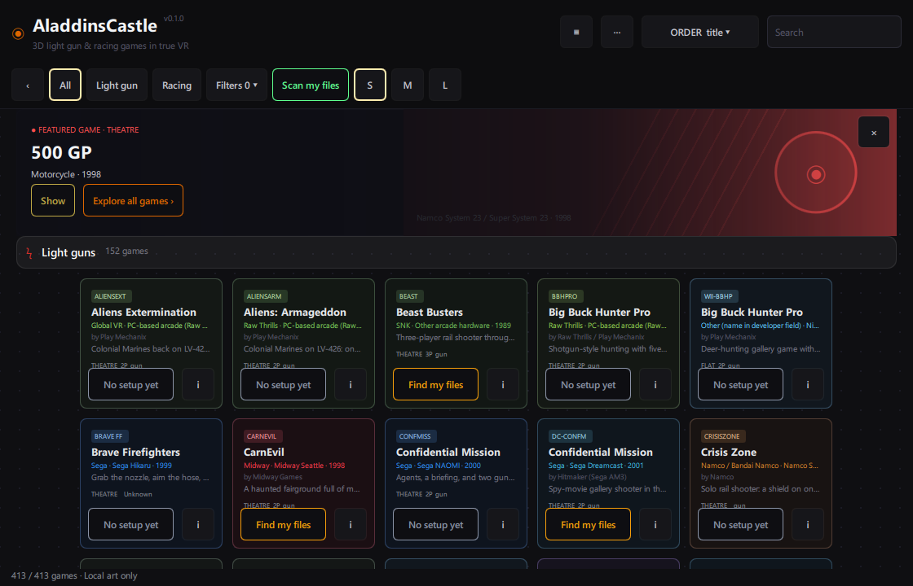
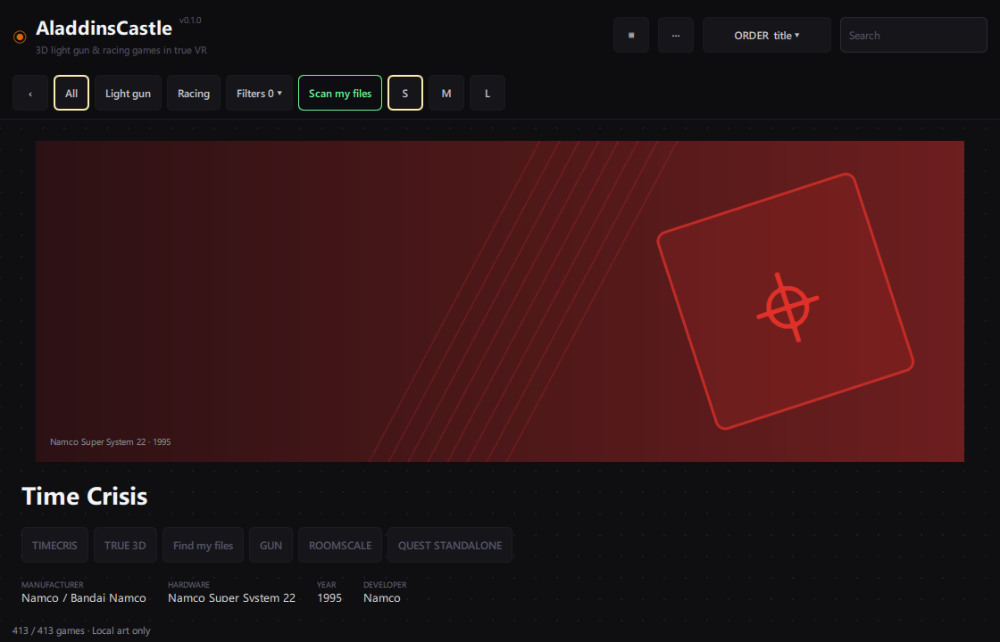

# S2: 413-game desktop grid

Measured on 2026-10-09 with the approved Qt 6.8.3/MSVC 2022 Release toolchain, OpenGL, Windows 11, Ryzen 9 5900X, RTX 3080 Ti and 31.9 GiB RAM. Window: 1120 × 720; actual scrolling viewport: 1120 × 565. All 413 catalog records were present. Art is the original inline-generated fallback; no game content or third-party game art was used.

## Final measurement

The Qt Test selfBenchmark function runs a native event loop and an 8 ms scroll-request timer for six seconds per mode, sweeping the complete list. QQuickWindow::frameSwapped supplies observed swap count and intervals. CPU time is the process kernel + user time from GetProcessTimes; resident memory is the process working set. These are desktop application measurements, not GPU timing or headset acceptance.

| Metric | MultiEffect neon baseline | Preferred cheaper glow |
|---|---:|---:|
| Average observed frameSwapped rate | 112.80 fps | 119.91 fps |
| Observed swaps | 682 | 719 |
| p95 swap interval | 22.73 ms | 16.79 ms |
| Process CPU time over sweep | 5.141 s | 4.281 s |
| Process CPU time per observed swap | 7.54 ms | 5.95 ms |
| Working set at end | 257.07 MiB | 247.04 MiB |
| GPU frame time | Not measured | Not measured |

Initial delegate count: 21 (including cached rows, far fewer than 413). Mean GameCard component creation over 100 instances: 0.936 ms, including QML creation/bindings but excluding scene GPU upload. This is a bounded one-pass result; it is not a long-session memory-growth test.

The average 60 fps budget passes on this desktop. The MultiEffect p95 interval exceeds a 16.67 ms deadline; even the preferred mode's 16.79 ms p95 is slightly above that deadline. A strict every-frame 60 fps guarantee is therefore not claimed. SteamVR dashboard and laser/headset sizing remain owner-operated lane B acceptance, and GPU-specific cost remains unmeasured.

## Applied fallbacks and correctness checks

An early pass missed the budget and exposed shell layout allocation problems. The final shell gives Header/FilterBar explicit implicit/preferred/max heights and gives the content the full remaining height. Normal startup is independently captured and asserted: content begins at y134, height565, with visible game cards; the detail hero begins at y158. Capture reset uses the list's own positionViewAtBeginning rather than assuming contentY = 0. The raw origin/contentY/item-coordinate trace is retained privately with the timing JSON.

The dot background is cached outside the scroll area. Portrait delegates have no model while their view is inactive. Card effects are lazy and instantiated only when needed; full-card caching is limited to the preview. Cheaper glow is the production default, while Settings can enable the neon MultiEffect baseline. The gradient-text mask produced mottled headings and added per-title effect cost; the permitted cheaper text fallback uses a clean theme-derived heading colour. QML still takes every colour from Theme.

The CI UI suite uses displayless software rendering. It verifies behavior and all 413 detail pages independently of these headed OpenGL timings. Install/scan/launch remain service signals, and success events cannot mark anything installed without the C catalog proof gates.

## Owned captures and reference

The upstream screenshot shows v0.8.2 and predates the v0.8.7.6 source inspected at commit a64401f, as the shell spec records. The parent reviewed our captures for layout, clean headings and privacy before they were added. They contain only catalog metadata and original fallback art.

| AladdinsCastle owned fallback capture | Upstream source (local reference capture is not tracked upstream) |
|---|---|
|  |  |

Raw receipts and exact local commands stay in the gitignored lane-local folder. To reproduce in an authorized headed session, set AC_UI_BENCH_OUTPUT to a private absolute JSON output path and run ui-tests selfBenchmark. Do not set that variable for CI or ordinary tests.
